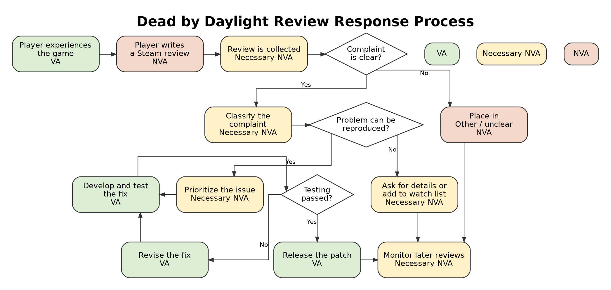
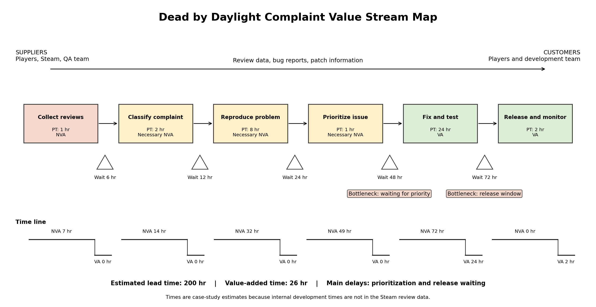

```{r setup, include=FALSE}

library(qcc)
library(SixSigma)
library(knitr)

knitr::opts_chunk$set(
  echo = FALSE,
  warning = FALSE,
  message = FALSE,
  fig.align = "center",
  out.width = "95%",
  fig.width = 8,
  fig.height = 5,
  fig.pos = "!ht"
)
```

```{r data-preparation, include=FALSE}
reviews_full <- read.csv(
  "steam_reviews_381210_english.csv",
  stringsAsFactors = FALSE
)

reviews_full$date_created <- as.Date(
  substr(reviews_full$date_created, 1, 10)
)

reviews_full$sentiment <- as.numeric(reviews_full$sentiment)

reviews <- reviews_full[
  reviews_full$date_created >= as.Date("2025-04-14") &
    reviews_full$date_created <= as.Date("2025-11-09"),
]

if (nrow(reviews) == 0) {
  stop("No reviews were found in the selected date range.")
}

reviews$week <- as.Date(
  cut(
    reviews$date_created,
    breaks = "week",
    start.on.monday = TRUE
  )
)

weeks <- sort(unique(reviews$week))
total <- numeric(length(weeks))
negative <- numeric(length(weeks))

for (i in seq_along(weeks)) {
  one_week <- reviews[reviews$week == weeks[i], ]
  total[i] <- nrow(one_week)
  negative[i] <- sum(one_week$sentiment == 0, na.rm = TRUE)
}

weekly <- data.frame(
  week = weeks,
  total = total,
  negative = negative
)

weekly$p <- weekly$negative / weekly$total

pbar <- sum(weekly$negative) / sum(weekly$total)
weekly$ucl <- pbar + 3 * sqrt(pbar * (1 - pbar) / weekly$total)
weekly$lcl <- pbar - 3 * sqrt(pbar * (1 - pbar) / weekly$total)
weekly$lcl[weekly$lcl < 0] <- 0

weekly$status <- "In control"
weekly$status[weekly$p > weekly$ucl] <- "Above UCL"
weekly$status[weekly$p < weekly$lcl] <- "Below LCL"

out_of_control <- weekly[weekly$status != "In control", ]
above_count <- sum(weekly$status == "Above UCL")
below_count <- sum(weekly$status == "Below LCL")

negative_reviews <- reviews[reviews$sentiment == 0, ]
negative_reviews$review[is.na(negative_reviews$review)] <- ""
text <- tolower(negative_reviews$review)
negative_reviews$category <- "Other/unclear"

hit <- grepl(
  paste(
    "crash|fps|frame|stutter|performance|laggy|freeze|freezing|",
    "optimization|bug|broken|glitch|fix your game|",
    "doesn.?t work|not work",
    sep = ""
  ),
  text
)
negative_reviews$category[hit] <- "Technical bugs/performance"

hit <- grepl(
  "server|disconnect|connection|ping|latency|network|rubberband",
  text
) & negative_reviews$category == "Other/unclear"
negative_reviews$category[hit] <- "Server/connection"

hit <- grepl(
  "matchmaking|queue|mmr|rank|ranked|skill.?based",
  text
) & negative_reviews$category == "Other/unclear"
negative_reviews$category[hit] <- "Matchmaking"

hit <- grepl(
  paste(
    "balance|balanced|unbalanced|overpowered|underpowered|",
    "nerf|buff|ability|abilities|killer|survivor|camping|",
    "tunnel|hook|perk|loop|slug|chase",
    sep = ""
  ),
  text
) & negative_reviews$category == "Other/unclear"
negative_reviews$category[hit] <- "Gameplay/balance"

hit <- grepl(
  "cheat|hacker|hack|exploit",
  text
) & negative_reviews$category == "Other/unclear"
negative_reviews$category[hit] <- "Cheating"

hit <- grepl(
  paste(
    "dlc|money|price|expensive|pay.?to.?win|",
    "microtransaction|cash|purchase|cosmetic|skin|buy",
    sep = ""
  ),
  text
) & negative_reviews$category == "Other/unclear"
negative_reviews$category[hit] <- "Monetization"

hit <- grepl(
  "privacy|data|eula|terms of service|personal information|consent",
  text
) & negative_reviews$category == "Other/unclear"
negative_reviews$category[hit] <- "Privacy/data"

hit <- grepl(
  "update|patch|devs|developer|bhvr|behavior|removed|change|rework",
  text
) & negative_reviews$category == "Other/unclear"
negative_reviews$category[hit] <- "Updates/developer decisions"

hit <- grepl(
  "toxic|community|teammate|team mate|grief|slur|racis|harass",
  text
) & negative_reviews$category == "Other/unclear"
negative_reviews$category[hit] <- "Toxicity/community"

hit <- grepl(
  paste(
    "not fun|no fun|boring|repetitive|bad game|worst game|",
    "hate|sucks|trash|terrible|horrible|unfun|",
    "waste of time|waste of money|not recommend",
    sep = ""
  ),
  text
) & negative_reviews$category == "Other/unclear"
negative_reviews$category[hit] <- "General enjoyment/design"

negative_reviews$actionable <-
  negative_reviews$category != "Other/unclear" &
  negative_reviews$category != "General enjoyment/design"

weekly$actionable <- 0

for (i in seq_along(weeks)) {
  one_week_negative <- negative_reviews[
    negative_reviews$week == weeks[i],
  ]

  weekly$actionable[i] <- sum(
    one_week_negative$actionable,
    na.rm = TRUE
  )
}

weekly$actionable_p <- weekly$actionable / weekly$total

counts <- sort(table(negative_reviews$category), decreasing = TRUE)

check_sheet <- data.frame(
  Complaint = names(counts),
  Count = as.numeric(counts)
)

check_sheet$Percent <- round(
  100 * check_sheet$Count / sum(check_sheet$Count),
  1
)

short_names <- c(
  "Other/unclear" = "Other",
  "Gameplay/balance" = "Gameplay",
  "Technical bugs/performance" = "Technical bugs",
  "General enjoyment/design" = "General design",
  "Updates/developer decisions" = "Updates",
  "Server/connection" = "Servers",
  "Monetization" = "Monetization",
  "Matchmaking" = "Matchmaking",
  "Toxicity/community" = "Toxicity",
  "Cheating" = "Cheating",
  "Privacy/data" = "Privacy"
)

check_sheet$ShortName <- short_names[check_sheet$Complaint]
missing_name <- is.na(check_sheet$ShortName)
check_sheet$ShortName[missing_name] <- check_sheet$Complaint[missing_name]

pareto_counts <- check_sheet$Count
names(pareto_counts) <- check_sheet$ShortName


out_table <- data.frame(
  Week = format(out_of_control$week, "%Y-%m-%d"),
  `Negative review rate` = paste0(round(100 * out_of_control$p, 1), "%"),
  Result = out_of_control$status,
  check.names = FALSE
)

ctq_table <- data.frame(
  CTQ = c(
    "Weekly negative-review proportion",
    "Weekly actionable-complaint proportion"
  ),
  Definition = c(
    "Negative reviews divided by all reviews in the week",
    "Reviews naming a specific issue divided by all reviews in the week"
  ),
  Direction = c("Smaller is better", "Smaller is better")
)

sipoc_table <- data.frame(
  Part = c("Suppliers", "Inputs", "Process", "Outputs", "Customers"),
  Details = c(
    "Players, QA testers, developers, server provider, and Steam",
    "Reviews, bug reports, game code, server data, and patch schedule",
    "Collect, classify, reproduce, prioritize, fix, test, release, and monitor",
    "Resolved issues, stable patches, patch notes, and lower negative-review rate",
    "Current players, future players, support team, and development team"
  )
)

tollgate_table <- data.frame(
  Stage = c("Define", "Measure", "Analyze", "Improve", "Control"),
  Tollgate = c(
    "Problem, scope, CTQs, SIPOC, and process map are agreed on",
    "Dates and sentiment are checked; weekly data and check sheet are ready",
    "Unusual weeks and main complaint categories are reviewed",
    "Owners are assigned and proposed changes are tested",
    "The chart, demerit score, and response plan are used each week"
  )
)

action_table <- data.frame(
  Signal = c("Point above UCL", "Point below LCL", "Repeated upward pattern"),
  `First action` = c(
    "Check the counts and read at least 50 reviews",
    "Check for a data error or a real improvement",
    "Compare the main complaint categories"
  ),
  `Next step` = c(
    "Compare patch and server records, then assign an owner",
    "Record the helpful change and watch the next four weeks",
    "Escalate the problem before the next major release"
  ),
  check.names = FALSE
)

demerit_table <- data.frame(
  Class = c("A - Critical", "B - Serious", "C - Major", "D - Minor"),
  Weight = c(100, 50, 10, 1),
  Examples = c(
    "Cannot launch; player progress is lost",
    "Repeated crash or disconnect; serious cheating exploit",
    "Major balance or matchmaking issue; paid content is broken",
    "Small visual or sound glitch; wording or translation error"
  )
)
```

# Course Scenario and Problem

For this project, I chose *Dead by Daylight*, an online multiplayer horror game where four survivors play against one killer. The game depends on servers, matchmaking, character abilities, frequent updates, and downloadable content. This creates many possible quality problems. In this case study, I am acting as a game quality analyst.

The problem is that the percentage of negative Steam reviews is fairly high and changes a lot from week to week. Steam is an online platform where people can buy, play, and review video games. I treated a negative review as a nonconforming unit because the player did not recommend the game. Reducing the problems behind those reviews could improve player satisfaction, keep more players active, improve the game's reputation, and help future sales.

# Define

The scope is English Steam reviews written from April 14, 2025 through November 9, 2025. The reviews are used as a measurable signal of player satisfaction. They cannot prove that one patch caused every complaint, and some reviews are based mostly on personal preference.

The main critical-to-quality characteristic, or CTQ, is the weekly proportion of negative reviews:

$$p_i = \frac{\text{negative reviews in week }i}{\text{total reviews in week }i}$$

A smaller value is better. The second CTQ is the weekly actionable-complaint proportion. It counts reviews that name a specific issue, such as balance, bugs, performance, servers, matchmaking, cheating, or monetization.

```{r ctq-table}
kable(ctq_table, format = "pipe", caption = "CTQ characteristics")
```

I am not trying to remove every negative review. The current average negative-review proportion is about `r round(100 * pbar, 1)`%. A reasonable first goal is to lower it below 20% within 12 weeks and avoid special-cause spikes above the upper control limit.

## SIPOC Diagram

```{r sipoc-table}
kable(sipoc_table, format = "pipe", caption = "SIPOC summary")
```

The table lists the SIPOC parts. The SixSigma process map below shows how the main inputs move through the complaint-response process and become outputs for players and the development team.

```{r sipoc-map, fig.cap="SIPOC process map made with the SixSigma package.", fig.width=10, fig.height=6.2, out.width="95%"}
steps <- c("COLLECT", "CLASSIFY", "REPRODUCE", "FIX AND TEST", "RELEASE")
inputs.overall <- c("Player reviews", "Bug reports", "Game and server data")
outputs.overall <- c("Stable patch", "Clear patch notes", "Lower negative-review rate")

input.output <- vector("list", length(steps))
input.output[[1]] <- c("Steam reviews")
input.output[[2]] <- c("Weekly review data")
input.output[[3]] <- c("Complaint categories")
input.output[[4]] <- c("Confirmed issue")
input.output[[5]] <- c("Tested fix")

x.parameters <- vector("list", length(steps))
x.parameters[[1]] <- list(c("Review date", "C"), c("Sentiment", "Cr"))
x.parameters[[2]] <- list(c("Keyword rule", "P"), c("Reviewer", "C"))
x.parameters[[3]] <- list(c("Platform", "C"), c("Patch version", "C"))
x.parameters[[4]] <- list(c("Developer", "C"), c("Test plan", "P"))
x.parameters[[5]] <- list(c("Release date", "C"), c("Server status", "N"))

y.features <- vector("list", length(steps))
y.features[[1]] <- list("Weekly data Cr")
y.features[[2]] <- list("Complaint category Cr")
y.features[[3]] <- list("Confirmed cause Cr")
y.features[[4]] <- list("Passed test Cr")
y.features[[5]] <- list("Lower negative rate Cr")

ss.pMap(
  steps,
  inputs.overall,
  outputs.overall,
  input.output,
  x.parameters,
  y.features,
  sub = "Dead by Daylight Review Project"
)
```

\clearpage

## Process Flowchart

```{r flowchart-image, fig.cap="Review-response flowchart. VA means value-added, necessary NVA means required but not directly value-added, and NVA means non-value-added.", out.width="95%"}

```

The main value-added steps are developing, testing, and releasing a useful fix. Collecting, classifying, reproducing, prioritizing, and monitoring are necessary but do not directly change the game. Unclear reviews and repeated waiting are non-value-added.

## DMAIC Tollgates

```{r tollgate-table}
kable(tollgate_table, format = "pipe", caption = "DMAIC tollgates")
```

The Define tollgate is passed when the problem, goal, scope, CTQs, SIPOC, and process steps are agreed on.

# Measure

The full file contains `r format(nrow(reviews_full), big.mark = ",")` reviews. The selected 30-week period contains `r format(sum(weekly$total), big.mark = ",")` reviews, including `r format(sum(weekly$negative), big.mark = ",")` negative reviews. The overall negative-review proportion is `r round(100 * pbar, 1)`%.

The weekly number of reviews changes, so I used a $p$-chart instead of an $np$-chart. A $p$-chart allows a different sample size each week. The negative-review count is the data and the total number of reviews is the sample size.

The Measure tollgate is passed after the date and sentiment columns are checked, the weekly groups are created, and the complaint check sheet is finished.

\newpage

## Weekly *p*-Chart

```{r p-chart-output, echo=FALSE, size="tiny"}
old_width <- getOption("width")
options(width = 10)

week_labels <- format(weekly$week, "%m/%d")

p_chart <- qcc(
  data = weekly$negative,
  type = "p",
  sizes = weekly$total,
  labels = week_labels,
  plot = FALSE
)

str(p_chart, max.level = 1, give.attr = FALSE)

options(width = old_width)
```

```{r p-chart-graph, echo=FALSE, fig.cap="Weekly p-chart for the proportion of negative reviews.", fig.width=8, fig.height=5, out.width="95%", fig.align="center", fig.pos="!ht"}
plot(
  p_chart,
  title = "Weekly Negative-Review Proportion",
  xlab = "Week",
  ylab = "Negative-review proportion",
  axes.las = 2,
  cex.axis = 0.75
)
```

## Check Sheet

I changed the review text to lowercase and used simple keyword rules to place each negative review into one complaint category. Each review was assigned to the first category that matched. Reviews without a clear keyword were placed in Other/unclear. This is less accurate than reading every review by hand, but it creates one consistent check sheet.

```{r check-sheet-table}
kable(
  check_sheet[, c("Complaint", "Count", "Percent")],
  format = "pipe",
  caption = "Complaint check sheet"
)
```

# Analyze

The $p$-chart center line is `r round(pbar, 4)`. There are `r nrow(out_of_control)` weeks outside the three-sigma limits: `r above_count` above the UCL and `r below_count` below the LCL. The highest weekly negative-review rate is `r round(100 * max(weekly$p), 1)`%, during the week starting `r format(weekly$week[which.max(weekly$p)], "%B %d, %Y")`.

Because several points are outside the limits and there is a clear upward shift later in the period, the process is not in statistical control. The unusual weeks should be compared with patch notes, server outages, balance changes, bug reports, and cheating reports. Those records are not included in the Kaggle data, so this project does not claim one exact cause.

```{r out-control-table}
kable(out_table, format = "pipe", caption = "Weeks outside the control limits")
```

The check sheet shows that Other/unclear is the largest category. Among the specific categories, gameplay/balance and technical bugs/performance are the two largest. These should receive the first improvement effort, while better complaint collection should reduce the unclear group.

## Pareto Chart

```{r pareto-chart, fig.cap="Pareto chart of negative-review complaint categories.", fig.width=9.5, fig.height=5.5, out.width="95%"}
par(mar = c(7, 4.5, 3, 4.5))

invisible(
  pareto.chart(
    pareto_counts,
    main = "Negative Review Complaint Categories",
    ylab = "Number of Negative Reviews",
    ylab2 = "Cumulative Percentage",
    las = 2,
    cex.names = 0.72
  )
)
```

## Chance and Assignable Causes

Chance causes include differences in player taste, random match results, normal changes in who writes reviews, and temporary internet problems on the player's side. These create normal variation and cannot be fully removed.

Assignable causes include a bad patch, server outage, broken ability, large balance change, cheating exploit, paid content that does not work, or matchmaking failure. These are specific problems that the company may be able to find and correct.

## Cause-and-Effect Diagram

```{r fishbone, fig.cap="Cause-and-effect diagram for a high negative-review rate.", fig.width=10, fig.height=5.7, out.width="95%", fig.pos="H"}
causes <- list(
  People = c("Limited QA staff", "Toxic behavior"),
  Methods = c("Short testing window", "Weak complaint triage"),
  Machines = c("Server overload", "Different hardware"),
  Code = c("Patch defects", "Third-party software"),
  Measurement = c("Subjective reviews", "Unclear review text"),
  Environment = c("High player traffic", "Regional network issues")
)

cause.and.effect(
  cause = causes,
  effect = "High negative-review rate",
  cex = c(0.75, 0.58, 0.82)
)
```

The Analyze tollgate is passed when the team reviews the out-of-control weeks, the Pareto chart, and the most likely assignable causes.

## Defect Concentration Diagram

A defect concentration diagram is not useful for this dataset because the reviews do not consistently list a map, character, screen, platform, or physical location. A future complaint form should collect those fields. The team could then make a diagram showing where crashes, visual bugs, or gameplay problems are concentrated.

# Improve

The first improvement is a standard in-game complaint form asking for platform, region, patch version, character, map, error type, and whether the issue can be repeated. This should reduce the large Other/unclear category and help developers reproduce problems faster.

The second improvement is a longer test period for major balance and performance updates. A small pilot group could test a patch before it reaches everyone. The team should compare crashes and disconnects across hardware, regions, and server conditions. Patch notes should also list known issues so players know the problem has been noticed.

## Value Stream Map

```{r vsm-image, fig.cap="Estimated value stream map based on the provided template. Times are case-study assumptions.", out.width="95%",fig.pos="H"}

```

The largest bottlenecks are the 48-hour wait for prioritization and the 72-hour wait for a release window. A 24-hour triage rule for serious complaints and an emergency hotfix path for critical defects would reduce those delays. The Improve tollgate is passed after owners are selected and the new complaint and pilot-release processes are tested.

# Control

The team should update the $p$-chart each week. A point above the UCL should start an investigation within one business day. The analyst should verify the counts, read at least 50 reviews, compare the timing with patch and server records, and assign an owner. A point below the LCL should also be checked because it may show a real improvement worth keeping.

## Out-of-Control Action Plan

```{r action-plan-table}
kable(action_table, format = "pipe", caption = "Out-of-control action plan")
```

\newpage

## Demerit System

```{r demerit-table}
kable(demerit_table, format = "pipe", caption = "Demerit system")
```

The weights are larger for defects that stop people from playing or cause permanent loss. Class A gets 100 points, Class B gets 50, Class C gets 10, and Class D gets 1. The weekly score is:

$$\text{Score} = 100A + 50B + 10C + D$$

The Control tollgate is passed when the chart, demerit score, response owner, and four-week follow-up are part of the normal weekly process.

# Conclusion

The review process was not in statistical control during the selected 30 weeks. The average negative-review rate was about `r round(100 * pbar, 1)`%, and several weeks were outside the control limits. The Pareto analysis suggests that gameplay balance and technical quality should be worked on first. The large unclear category also shows that better complaint collection is needed.

Steam reviews are subjective and may mention more than one issue, so this project cannot prove the exact cause of every negative review. Even with that limitation, DMAIC gives the team a clear way to define the problem, measure weekly results, find unusual periods, test improvements, and keep monitoring after changes are made.

\newpage

# Appendix A: Data Availability

The review data were downloaded from [[**Steam Reviews English - Dead by Daylight on Kaggle**]{.underline}](https://www.kaggle.com/datasets/nicolamustone/steam-reviews-english-dead-by-daylight?resource=download)[**.**]{.underline}

The complaint categories are based on keyword rules, so some reviews may be placed in the wrong category. The dataset also does not include internal server logs, confirmed bug causes, or exact development times.

# Appendix B: R Code

```{r appendix-code, ref.label=c("setup", "data-preparation", "ctq-table", "sipoc-table", "sipoc-map", "flowchart-image", "tollgate-table", "p-chart-output", "p-chart-graph", "check-sheet-table", "out-control-table", "pareto-chart", "fishbone", "vsm-image", "action-plan-table", "demerit-table"), eval=FALSE, echo=TRUE}
```
